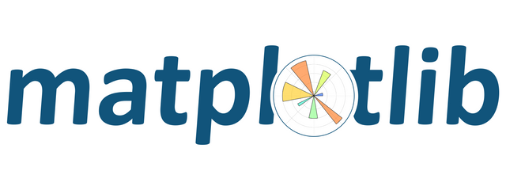

<!-- PROJECT LOGO -->
 

  
<h1>Investigate dataset</h1>

  

    
  

 

## Table of Contents

* [About this project](#about-this-projectd)
  * [Dataset](#dataset)
* [Libreries](#libreries)

## About this project

This project created to clean and produce analysis at the cost of a dataset, in our case **TMDB 5000 Movie**

### Dataset

-   **TMDB 5000 Movie**

## Libraries

-   pandas
-   matplotlib
-   seaborn

